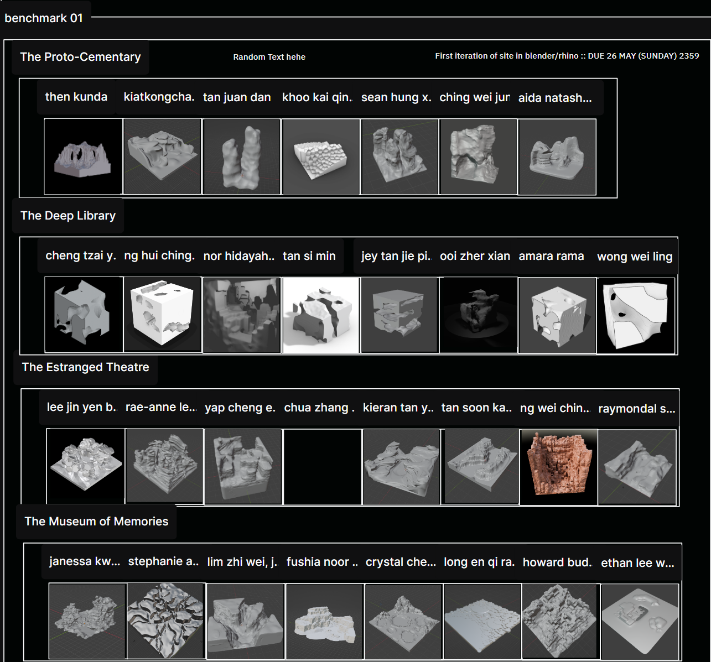

# TLExtractor

TLExtractor is a Python script designed to extract specific data from tldraw pages. It utilizes a template to ensure data accuracy. Extracted data is saved as JSON, while images are stored in a folder named after the project title. This script accommodates two scenarios: the **standard tldraw** and **tldraw with a custom submission template**, each with unique but similar designs.

## 📄 Custom Submission Template

For more information on the **custom submission template**, visit:
[Custom Submission Template](https://github.com/LamJingJie/tldraw/tree/dynamic_submission_template)

## ✨ Features

- **🔍 Depth-first Search**: Utilized for data searching and saving.
- **🧵 Multi-Threading**: Opens multiple threads of pages and uses Playwright to extract data respectively.
- **⚙️ Multi-Processing**: Processes multiple images, especially useful when there are a lot of images that need processing. Multi-Processing (20) is nested inside Multi-Threading as the start is more I/O intensive and the end is more CPU intensive.

## 📋 Template Format

The script requires data in a specific format:

- Text including the page description and date should follow the format: `<description>::<date>`, nested in the main/outermost frame only.
- Only use 'frames' or 'groups' for grouping.
- The main/outermost frame name must match the page name exactly.
- For **standard tldraw**, frame each person's submissions together, including their names in the frame.
- Avoid special characters.
- Do not further 'frame' the submissions that are already inside the student frame.

### 🖼️ Template Examples

| Template | Description |
|----------|-------------|
| **Template 1** | For 1 submission per student |
|  | |
| **Template 2** | For multiple submissions per student |
|  | |
| **Template 3** | For multiple nested groupings |
|  | |
| **Template 4** | For custom submission template |
|  | |

## 🛠️ Prerequisites

Before starting, ensure you have:

- Installed the latest versions of [pipenv](https://pipenv.pypa.io/en/latest/) and [pip](https://pypi.org/project/pip/#history).
- A `Python 3.x` environment.

## 🚀 Installation

To install TLExtractor:

1. Clone the repository or download the source code.
2. Navigate to the project directory.
3. Install the virtual environment (for ease of dependencies installation):

    ```bash
    pip install pipenv
    ```

4. Activate the virtual environment:

    ```bash
    pipenv shell
    ```

5. Install the project dependencies:

    ```bash
    pipenv install
    ```

## Usage

To use TLExtractor, follow these steps:

```bash
python tlextractor.py
```

## 🎥 Demo Video

[](https://github.com/user-attachments/assets/dc9f5a26-42ee-4a25-8939-9bdc7ec75dfa)
