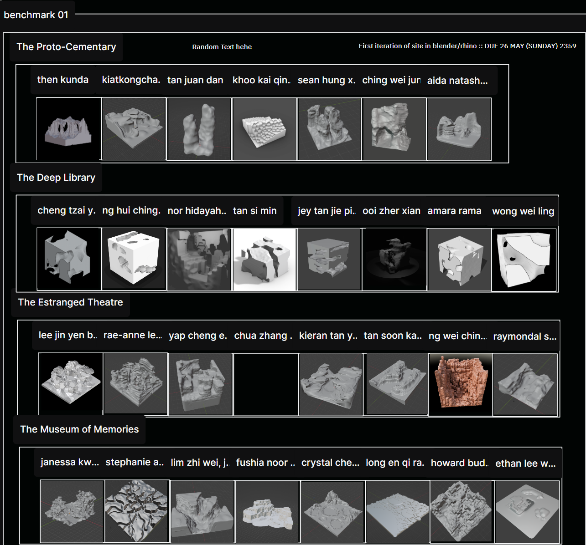
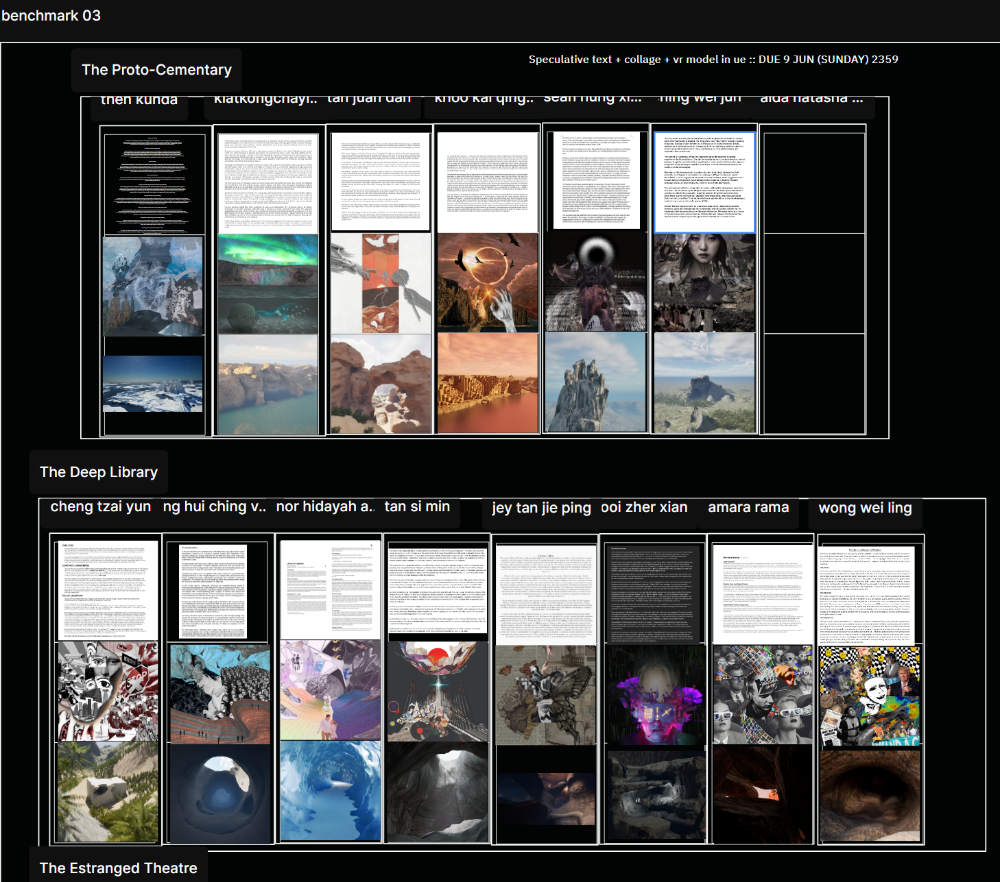

# TLExtractor

TLExtractor is a Python script designed to extract specific data from pages from tldraw. It uses a template to ensure the accuracy of the data being extracted.

## Template Format

The script requires the data to be in a specific format:




* The text that includes the page description and date should be in this format: `<description>::<date>`. It must also be nested at the main frame ONLY.
* Use only frames to 'group' things together.
* Ensure the main frame name is the exact same as the page name.

## Prerequisites

Before you begin, ensure you have met the following requirements:

* You have installed the latest version of [pipenv](https://pipenv.pypa.io/en/latest/) and [pip](https://pypi.org/project/pip/#history).
* You are using a `Python 3.x` version.

## Installation

To install TLExtractor, follow these steps:

1. Clone the repository or download the source code.
2. Navigate to the project directory.
3. Install the virtual environment:

    ```bash
    pip install pipenv
    ```

4. Activate the virtual environment:

    ```bash
    pipenv shell
    ```

5. Install the project dependencies:

    ```bash
    pipenv install
    ```

## Usage

To use TLExtractor, follow these steps:

```bash
python tlextractor.py
```
